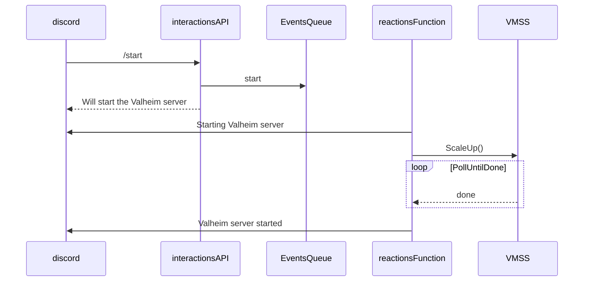
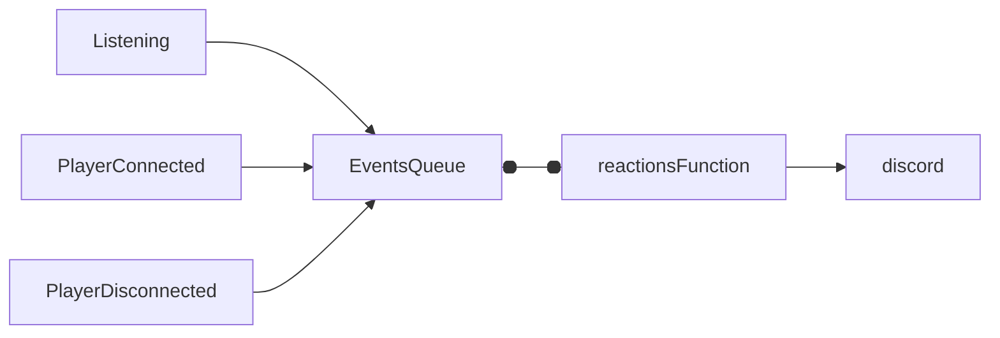

# About
This repository contains the [infrastructure code](infra/) and [discord bot code](discordbot/) for the Valheim game server.\
The idea here is to provision a server as cheap as possible, so I'm using a VMSS with spot instances and local OS disk. For the game server data, I'm using a mounted file share.\
Also, to further decrease cost, I wrote an event-driven slash-command discord bot on Azure Function so players can start and stop the server from discord.

The decision to use a serverless function was primarily driven by cost, as Azure provides 1 million free executions per month. However, this choice comes with added complexity as a tradeoff.

# Architecture
So the way this works is, discord sends a slash-command to an interactions API which is an http-triggered Azure Function, because discord requires a response within 3 seconds,
the only responsability of the interactions api is to put whatever command to an `events` queue and respond back to discord.\
After that, a reaction queue-triggered function is responsible for executing the task, reporting back to discord the status.

here is the sequence diagram of the `start` command

The second part of the solution is monitoring the Valheim game server logs to report on other stuff like:
- game server actually available for connections
- user connected
- user disconnected

and possibly others

For this, I wrote a [script in cloud-init.yml](infra/cloud-init.yml) that monitors valheim container logs and whenever there is a log line matching one of the patterns I'm looking for, put that log line as-is in the `events` queue.

Last but not least, I also needed a place to persist server state, so I chose table storage. Currently there are three attributes being persisted, `ip`, `online_players` and `status`.

One thing that is worth mentioning is that, as Azure functions can execute in parallel, optimistic concurrency control with `ETags` was used. So if more than one event is processed at the same time, whoever writes first wins, the others will just fail. The retry is builtin with the dequeue counter on the queue message. I also increased the retry interval by increasing the `visibilityTimeout` property in the queue config so the functions can have enough time and tries to reconcile the state.
