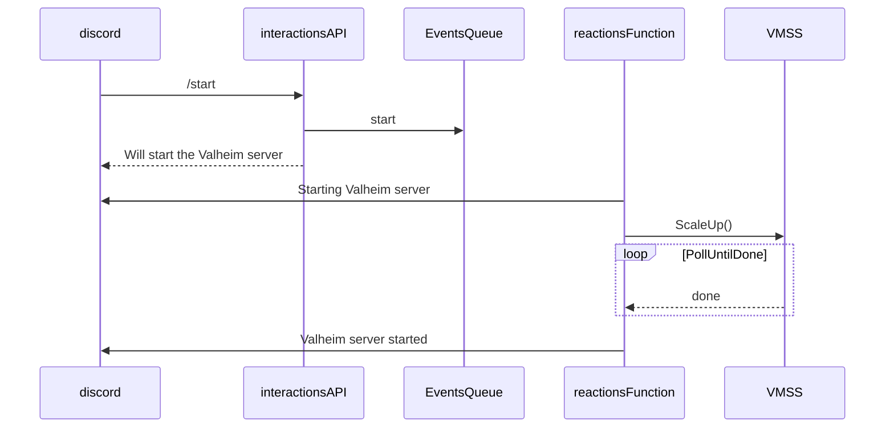
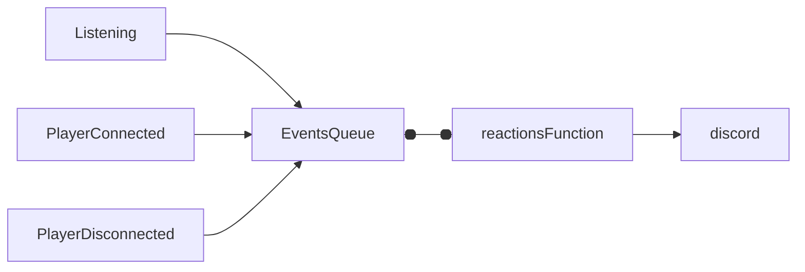

- [About](#about)
- [Architecture](#architecture)
    - [Interactions and reactions](#interactions-and-reactions)
    - [Game events](#game-events)
    - [Persisting state](#persisting-state)
    - [Azure Function OS and language choice](#azure-function-os-and-language-choice)
- [Possible improvements](#possible-improvements)

# About
This repository contains the [infrastructure code](infra/) and [discord bot code](discordbot/) for the Valheim game server.\
The idea here is to provision a server as cheap as possible, so I'm using a VMSS with spot instances and local OS disk. For the game server data, I'm using a mounted file share.\
Also, to further decrease cost, I wrote an event-driven slash-command discord bot on Azure Function so players can start and stop the server from discord.

The decision to use a serverless function was primarily driven by cost, as Azure provides 1 million free executions per month. However, this choice comes with added complexity as a tradeoff.

# Architecture
### Interactions and reactions
So the way this works is, discord sends a slash-command to an interactions API which is an http-triggered Azure Function, because discord requires a response within 3 seconds,
the only responsability of the interactions api is to put the command to an `events` queue and respond back to discord.\
After that, a reaction queue-triggered function is responsible for executing the task, reporting back to discord the status.

here is the sequence diagram of the `start` command

### Game events

The second part of the solution is monitoring the Valheim game server logs to report on game events like:
- game server actually available for connections
- user connected
- user disconnected

and possibly others

For this, I wrote a [script in cloud-init.yml](infra/cloud-init.yml) that monitors valheim container logs and whenever there is a log line matching one of the patterns I'm looking for, put that log line as-is in the `events` queue.

### Persisting state

I also needed a place to persist server state, so I chose table storage. Currently there are three attributes being persisted, `ip`, `online_players` and `status`.

One thing that is worth mentioning is that, as Azure functions can execute in parallel, optimistic concurrency control with `ETags` was used. So if more than one event is processed at the same time, first write wins, the others will just fail. The retry is builtin with the dequeue counter on the queue message, maximum of 5. I also increased the retry interval by increasing the `visibilityTimeout` property in the queue config so the functions can have enough time to reconcile the state.

### Azure Function OS and language choice
One of the biggest challenges in this setup was making sure the bot responded in under 3 seconds, even with cold starts in Azure Functions.

I started with a Python bot running in a Linux function app (the only OS option for Python). Right away, I ran into issues—during cold starts, the function took too long to respond, and Discord would time out multiple times. So, I looked at using Go instead. Go compiles down to a single executable and generally runs faster. I deployed it, not realizing I was using a Windows function app. Surprisingly, it worked great, consistently responding within the 3-second limit, even with cold starts.

When I noticed it was running on Windows, I switched it over to a Linux app, expecting similar performance. To my surprise, it actually performed worse on Linux.

After this trial and error, I decided to set up a more controlled test. I deployed all three setups—Python on Linux, Go on Windows, and Go on Linux—and used a Postman monitor to send a request to each function every hour. This way, I could see how each configuration handled cold starts over time.

here are the results in seconds:
|            | Average | P95   | P99   |
|------------|---------|-------|-------|
| Python     | 10.43   | 12.02 | 13.35 |
| Go Linux   | 5.84    | 7.77  | 7.64  |
| Go Windows | 1.07    | 1.70  | 1.85  | 

# Possible improvements
There are some quality-of-life improvements and additional features that could be added, but one critical aspect involves using spot instances. While spot instances significantly reduce server costs, they come with the risk of losing progress, potentially rolling back the world state to the last save if an eviction occurs.

To mitigate this risk, the recommended approach is to create a script or application within the spot VM that monitors the scheduled events endpoint. If a preemption event is detected, the script would run docker stop valheim-server, sending a SIGTERM to the container and triggering a world save.

After that, it’s just a matter of finding another available zone or instance size to restart the server, but at least the data will be saved.
